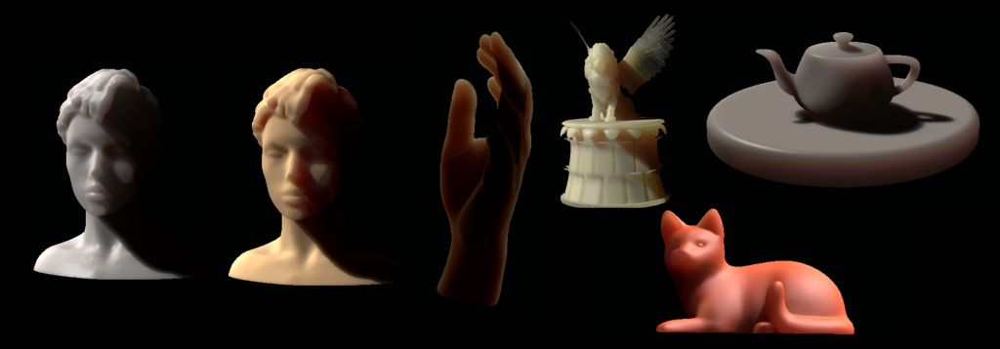
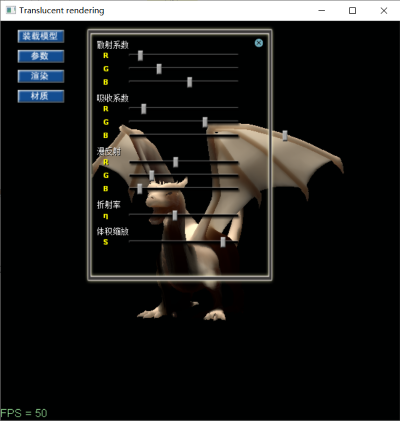
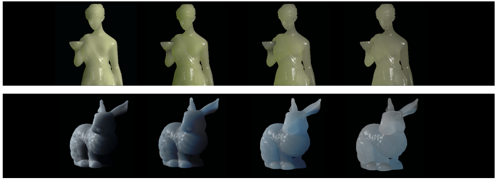
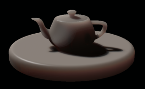
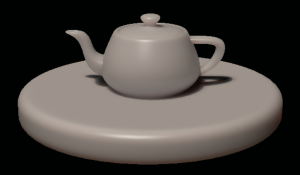
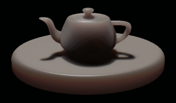
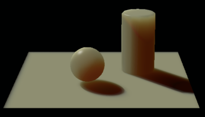

Translucent
===========

Real time rendering of BSSRDF objects. Implementation of my paper _[Real-Time Rendering of Translucent Objects with Variable Sizes](https://github.com/redclock/my-papers/blob/master/Real-Time%20Rendering%20of%20Translucent%20Objects%20with%20Variable%20Sizes.pdf)_ (2009)

Implemented on Windows / DirectX 9.0c.

## Screenshot

The following parameters of the material are configurable:
* Scattering
* Absorption
* Diffuse
* Refractive index
* Size

## Results

